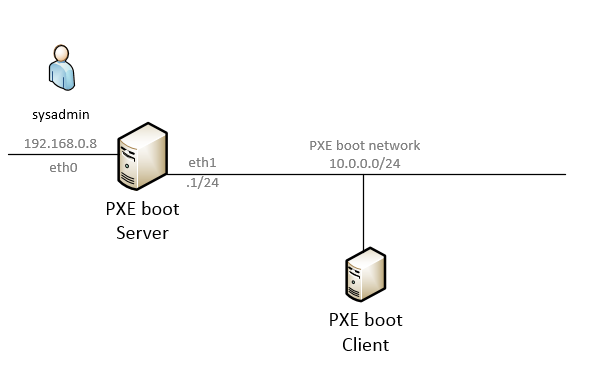
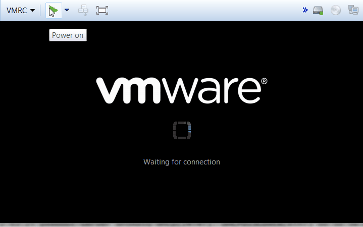

# Build your own PXE boot server

This article is a step by step guide for building your own PXE boot infrastructure which can be used to boot both legacy BIOS and EFI based hardware from network. There are many articles on the Internet for building PXE boot infrastructure however I found most of them does not work for EFI based hardware. I use [iPXE](http://ipxe.org/) as the boot image and [dnsmasq](http://www.thekelleys.org.uk/dnsmasq/doc.html) as DHCP & TFTP server and I found it's dead simple to setup those two software. 

## Lab setup

1. PXE Boot server (**Centos 7.5**) with two interfaces. Interface 'eth0' is for sysadmin to login and manage the server. Interface 'eth1' is connected to the PXE boot subnet.
2. PXE Boot subnet (10.0.0.0/24). This is an isolated network created just for booting new servers on the network. I strongly suggest to use isolated network for PXE boot to prevent it from interfering with existing DHCP servers on the network. 
3. PXE Boot client. A VMware VM set to PXE boot from network.  



## Step by step guide

### Part 1. Setup the bare bone PXE boot server

1. Make network interface connected to PXE boot network is correctly configured

   ```bash
   [sysadmin@pxeboot-server ~]$ sudo ifconfig eth1 10.0.0.1 netmask 255.255.255.0 up
   ```

   if `ifconfig` command is not available on your machine, you can add IP address this way:

   ```bash
   [sysadmin@pxeboot-server ~]$ sudo ip addr add 10.0.0.1/24 dev eth1
   [sysadmin@pxeboot-server ~]$ sudo ip link set eth1 up
   ```

2. Update PXE boot server to latest version

   ```bash
   [sysadmin@pxeboot-server ~]$ sudo yum update -y
   ```

3. Install required packages

   ```bash
   [sysadmin@pxeboot-server ~]$ yum install -y ipxe-bootimgs dnsmasq 
   ```

4. Create TFTP root directory

   ```bash
   [sysadmin@pxeboot-server ~]$ mkdir /tftpboot
   ```

   (optional) Set the directory security label if SELinux is enforced

   ```bash
   [sysadmin@pxeboot-server ~]$ sudo chcon -t tftpdir_t /tftpboot
   ```

   

5. Copy iPXE boot images to TFTP directory

   ```bash
   [sysadmin@pxeboot-server ~]$ sudo cp /usr/share/ipxe/{undionly.kpxe,ipxe.efi} /tftpboot/
   ```

   `undionly.kpxe` is for legacy BIOS based hardware
   `ipxe.efi` is for EFI based hardware

6. Create iPXE menu directory and boot menu

   ```
   $ sudo mkdir /tftpboot/menu
   ```

   create a simple boot menu which drops to the iPXE shell

   ```
   sudo vi /tftpboot/menu/boot.ipxe
   ```

   with content :

   ```
   #!ipxe
   
   menu PXE Boot Options
   
   item shell iPXE shell
   item exit  Exit to BIOS
   
   choose --default exit --timeout 10000 option && goto ${option}
   
   :shell
   shell
   
   :exit
   exit
   ```

   Full iPXE command help can be found [here](http://ipxe.org/cmd)

7. Create dnsmasq config file at /etc/dnsmasq.conf.
   Delete all old content before editing.

   ```
   # enable logs if required
   #log-queries
   #log-dhcp
   
   # disable DNS server
   port=0
   
   # listen on PXEBOOT vlan (vlan110) only
   listen-address=10.0.0.1
   interface=eth1
   
   # enable built-in tftp server
   enable-tftp
   tftp-root=/tftpboot
   
   
   # DHCP range 10.0.0.200 ~ 10.0.0.250
   dhcp-range=10.0.0.200,10.0.0.250,255.255.255.0,24h
   
   # Default gateway
   dhcp-option=3,10.0.0.1
   
   # Domain name - homelab.net
   dhcp-option=15,homelab.net
   
   # Broadcast address
   dhcp-option=28,10.0.0.255
   
   # Set interface MTU to 9000 bytes (jumbo frame)
   # Enable only when your network supports it
   # dhcp-option=26,9000
   
   # Tag dhcp request from iPXE
   dhcp-match=set:ipxe,175
   
   # inspect the vendor class string and tag BIOS client
   dhcp-vendorclass=BIOS,PXEClient:Arch:00000
   
   # 1st boot file - Legacy BIOS client
   dhcp-boot=tag:!ipxe,tag:BIOS,undionly.kpxe,10.1.0.1
   
   # 1st boot file - EFI client
   # at the moment all non-BIOS clients are considered
   # EFI client
   dhcp-boot=tag:!ipxe,tag:!BIOS,ipxe.efi,10.1.0.1
   
   # 2nd boot file
   dhcp-boot=tag:ipxe,menu/boot.ipxe
   ```

8. Open firewall rules to allow inbound DHCP and TFTP requests

   ```bash
   $ sudo firewall-cmd --add-service=dhcp --permanent
   $ sudo firewall-cmd --add-service=tftp --permanent
   $ sudo firewall-cmd --reload
   ```

9. Start **dnsmasq** and make sure it's running

   ```
   $ sudo systemctl start dnsmasq
   $ sudo systemctl status dnsmasq
   ● dnsmasq.service - DNS caching server.
      Loaded: loaded (/usr/lib/systemd/system/dnsmasq.service; disabled; vendor preset: disabled)
      Active: active (running) since Sat 2018-06-09 12:01:23 AWST; 6min ago
    Main PID: 24141 (dnsmasq)
      CGroup: /system.slice/dnsmasq.service
              └─24141 /usr/sbin/dnsmasq -k
   ```

10. Now you can power on the client machine and, if the network has been configured correctly, you should see the boot process looks like this one:
    

### Part 2: Add CentOS 7 network installation option 